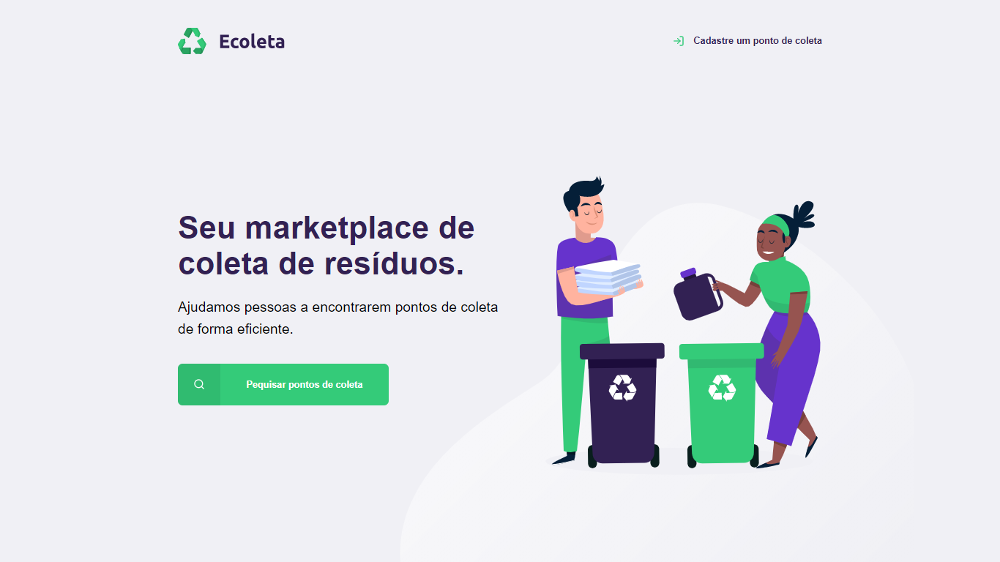

<p align="center">
    </img>
    <p align="center">Application that helps people find collection points efficiently, made with Nodejs, Nunjucks, Express and SQLite.</p>
</p>

</img>

<p align="center">Rocketseat's Intensive Course Learning Project (Next Level Week #1)</p>

# Installation
> npm is required

After cloning the project on the computer we will execute the following commands

## Website
In the project root folder just type the following lines of code in the terminal

```
npm install
npm start
```

# License
This project is under MIT license. See the [LICENSE](https://opensource.org/licenses/MIT) file for more details.